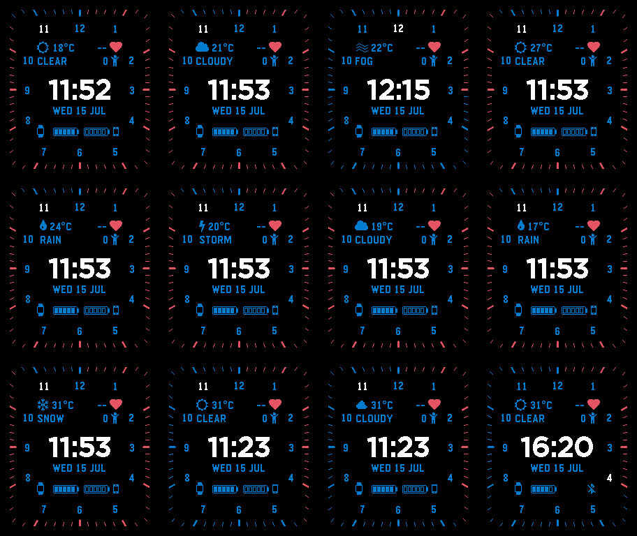

# Modern Analog

Modern Analog is a configurable hybrid digital watchface for Pebble Time 2. It keeps the visual rhythm of a classic clock face without using hands: the current hour is highlighted in white, while a red minute rim advances around the edge of the display.

## Preview

### Default-color overview



## Features

- Large, glanceable digital time with a centered date
- Twelve clock numerals and 60 edge-to-edge minute ticks
- White current-hour highlight and red elapsed-minute rim
- Weather from Open-Meteo, with the latest successful reading cached for offline use
- Heart rate and daily step count from Pebble Health
- Five-segment watch and phone battery gauges
- Bluetooth-disconnect indicator and a double vibration when the phone connection drops
- Independent content and color settings for all four corner positions

Modern Analog currently targets **Pebble Time 2 (Emery)** and uses Alloy/Moddable JavaScript for the watch-side interface.

## Default layout

| Position | Content |
| --- | --- |
| Top left | Weather glyph, temperature, and condition |
| Top right | Heart rate and steps |
| Bottom left | Watch battery |
| Bottom right | Phone battery or Bluetooth-off indicator |

The default palette is black (`#000000`) for the background, white (`#FFFFFF`) for the time and active hour, blue (`#0055FF`) for the dial, date, and widgets, and red (`#FF0000`) for minute progress. Heart icons remain red for quick recognition regardless of the configured widget color.

Open the watchface settings in the Pebble mobile app to customize:

- Top-left and top-right content: weather, combined health, steps, or heart rate
- Bottom-left and bottom-right content: watch battery or phone battery
- Temperature units: Celsius, Fahrenheit, or Kelvin
- Time display: 24-hour or 12-hour with AM/PM
- Background, time, clock, minute-rim, and individual corner colors

Unsupported saved values are replaced with safe defaults when the watchface starts.

## Data and update behavior

- Time, watch battery, heart rate, and steps refresh every minute.
- Phone battery is sent when the companion starts, when the phone reports a battery-level change, and during the companion's periodic refresh.
- Weather refreshes at most every 30 minutes. The companion uses phone location to request the current temperature and weather code from [Open-Meteo](https://open-meteo.com/); no API key is required.
- The latest successful weather reading is cached on both the phone and watch. If no live or cached reading exists, the weather slot stays empty instead of showing placeholder data.

Phone battery availability depends on the Battery Status API exposed by the Pebble mobile app's JavaScript environment. Unsupported environments show an empty gauge rather than a made-up value.

## Privacy

Modern Analog does not use accounts, analytics, advertising, or API keys. The companion requests the phone's location only to fetch local weather from Open-Meteo. Coordinates are sent directly to Open-Meteo and are not stored by the watchface; only the latest temperature, condition, and update time are cached locally. Phone and watch battery values, heart rate, and step count remain on the paired phone and watch.

## Build and install

Prerequisites:

- Pebble SDK with Emery support (tested with SDK 4.17)
- Node.js and npm
- An Emery emulator or Pebble Time 2 reachable by the Pebble CLI

Install the locked dependencies, verify the source, and build the watchface:

```sh
npm ci
npm run verify
npm run build
```

The installable bundle is written to `build/modernAnalogPebble.pbw`.

The compact generated icon fonts are committed, so Python is not required for a normal build. To change their glyph mappings, install the pinned FontTools dependency and regenerate them first:

```sh
python -m pip install -r requirements-dev.txt
npm run build:icons
```

For a clean release build, run `npm run release`.

Install it in the emulator:

```sh
pebble install --emulator emery
```

Or install it on a connected device:

```sh
pebble install --phone <device-address>
```

## Project structure

```text
src/embeddedjs/    Alloy watchface rendering and embedded resources
src/pkjs/          PebbleKit JS companion, weather, battery, and settings UI
src/c/             Small native bridge for Pebble Health data
test/              Companion settings validation tests
assets/screenshots/ Release screenshots captured from the Emery emulator
```

## Inspiration and credits

Modern Analog was inspired by **[Hybrid Minimal](https://github.com/rafaelc007/hybrid-minimal)**, a Pebble watchface by **Rafael Pereira**. You can also find the original watchface on the **[RePebble app store](https://apps.repebble.com/hybrid-minimal_4e657ee63bad434faffca284)**.

This project also uses subset glyphs from [Material Design Icons](https://pictogrammers.com/library/mdi/) and [Font Awesome 4.7](https://fontawesome.com/v4/). See [Third-Party Notices](THIRD_PARTY_NOTICES.md) for attribution and license details.

## Contributing

Bug reports and focused improvements are welcome. See [CONTRIBUTING.md](CONTRIBUTING.md) for the development and verification workflow.

## License

Copyright 2026 EladDV. Licensed under the [Apache License 2.0](LICENSE).
